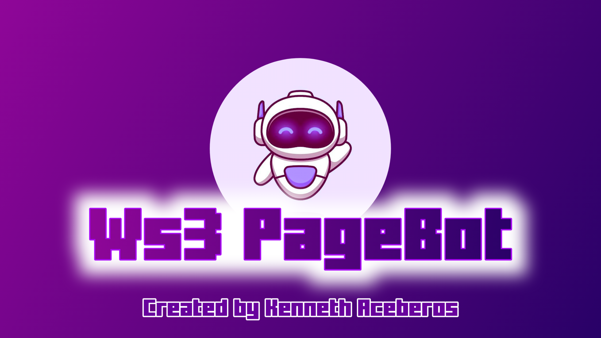
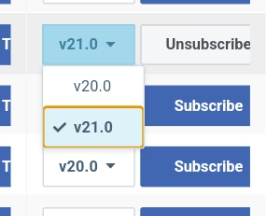
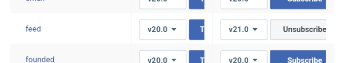
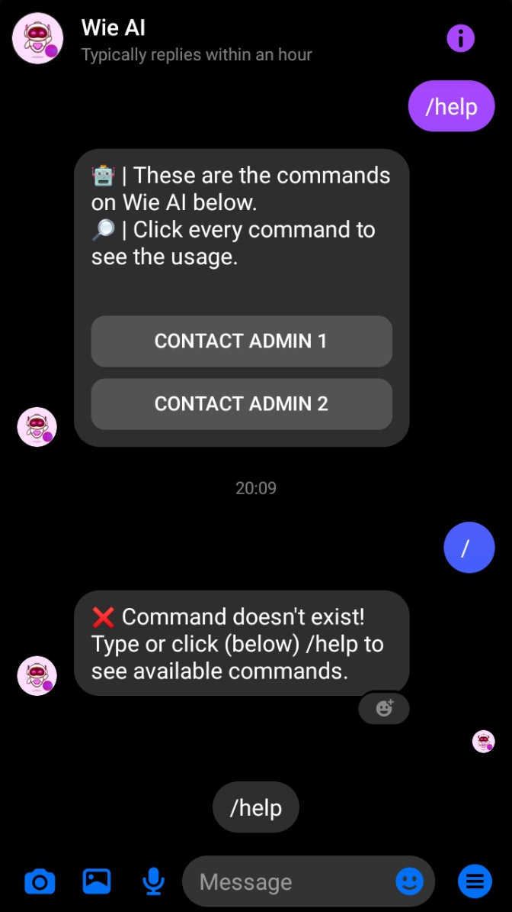
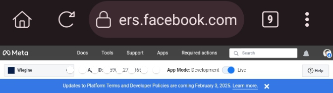

<!DOCTYPE html>
<html lang="en">

# Ws3 PageBot
Created by Kenneth Aceberos

This page bot is originally from: [https://github.com/muhammadoren/Ai-Page-Bot](https://github.com/muhammadoren/Ai-Page-Bot).

**Ws3 PageBot is a dedication to her (my gf).**

## Prerequisites
Before starting, ensure you have a Facebook Page. If you don't have one, create a Facebook Page first.

## Step 1: Go to Facebook Developers
1. **Navigate to Facebook Developers:**
   - Open your web browser and go to [developers.facebook.com](https://developers.facebook.com).

2. **Create a Developer Account (if you don’t have one):**
   - If you’re new to Facebook Developers, log in with your Facebook credentials and follow the prompts to set up a developer account.

## Step 2: Create an App
1. **Create an App:**
   - Click on "My Apps" in the top-right corner.
   - Select "Create App".
   - Choose "Business" as the type of app.
   - Fill out the required details such as the app display name and contact email, then click "Create App ID".

## Step 3: Add Messenger Product
1. **Add Messenger:**
   - In the left sidebar of your app's dashboard, click on "Add Product".
   - Find "Messenger" and click on the "Set Up" button next to it.

## Step 4: Connect Your Facebook Page
1. **Generate a Page Access Token:**
   - Scroll down to the "Access Tokens" section.
   - Click on "Add or Remove Pages".
   - Follow the prompts to connect your Facebook Page.
   - Once connected, generate a Page Access Token by clicking "Generate Token". Copy this token for later use.

## Step 5: Set Up Webhooks
 1. **Subscribe "feed" on Webhooks section**
   - Go to menu then find **Webhooks**. Locate "feed", once you see it change the version to v21.0
   
   - After you changed it click SUBSCRIBE
   
   - Now you're Done
  2. **Configure the Webhooks (Messenger)**
   - In the Messenger settings, scroll to the "Webhooks" section.
   - Click on "Setup Webhooks".
   - Enter the following details:
     - **Callback URL:** `https://your_hosting.site/webhook`
     - **Verify Token:** `ws3`
   - Subscribe to the following fields:
     - `messages`
     - `messaging_optins`
     - `messaging_postbacks`
   - Click "Verify and Save".
## Step 6: Add Page Subscriptions
1. **Subscribe to Page Events:**
   - Still in the Webhooks section, under "Page Subscriptions", select the page you connected earlier.
   - Ensure that `messages`, `messaging_optins`, and `messaging_postbacks` are selected for this subscription.

## Step 7: Get Your Page Access Token
1. **Retrieve Token:**
   - Go back to the "Access Tokens" section.
   - Copy the generated Page Access Token.

## Step 8: Enter Page Access Token
1. **Configure Bot with Token:**
   - Paste the Page Access Token into `ws3/api.js` on `const token`
   
   **You can also input your token on Environments**`(process.env.token)`
## Step 9: Test Your Messenger Bot
1. **Test Bot Functionality:**
   - Open your connected Facebook Page.
   - Send a message to your page.
   - Just send the prefix(Default is "/") or "hi" to check if it's now working.

## Note:
- You're in developer mode, that means that the bot only respond to accounts that have specific roles assigned within the app. To use the bot from a different account or user, Just switch to Live Mode and now your bot is ready to go 😉

## How to switch to Live Mode?
- Find **App Mode** then switch to Live
- You're Done

**You can now use the bot to all users once they messaged you**
## Credits
  - This file is originally from muhammadoren's [Ai-Page-Bot](https://github.com/muhammadoren/Ai-Page-Bot).
  - **Joshua sy (deku)** - API
  - **All developers and coders on ChatBot Community** - for helping to build this page bot
    
  **Note!**
   - You are free to modify this file. You can do whatever you want.

</html>